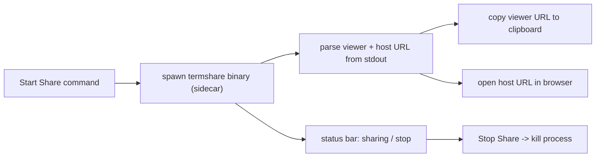

# Path C — VS Code extension build plan

A phased, commit-by-commit plan to package termshare as a VS Code extension:
a "Start Share" command that launches the termshare binary, copies the viewer
link, and opens the browser (later: status bar, stop share, bundled binaries,
optional xterm webview, marketplace publish).

## Time estimate

| Phase | Scope | Effort |
|-------|-------|--------|
| 0 | Go glue: stable machine-readable URL output + build script | ~0.5 day |
| 1 | MVP extension: start/stop share, copy link, open browser | 1-2 days |
| 2 | Solid extension: status bar, bundled per-OS binaries, settings, error UX, optional xterm webview | 3-5 days |
| 3 | Marketplace-ready: icon, README, CI packaging, publish | +2-3 days |

- MVP only (Phase 0 + 1): ~2-2.5 days
- Solid, sideloadable `.vsix` (Phase 0-2): ~1 week
- Published to Marketplace (Phase 0-3): ~1-1.5 weeks
- Add ~1 day if this is your first VS Code extension (learning the API)

## Platform caveat (read first)

The PTY backend is Unix-only (`pty.Start` returns unsupported on native
Windows). The extension is fine to develop on Windows, but the termshare
process it launches must run on Linux/macOS. On a Windows workstation that
means launching the binary **inside WSL** (`wsl.exe ... termshare`) or pointing
the extension at a remote Unix host. Plan the "how do we spawn the server"
setting around this from Phase 1.

## Architecture

The extension is mostly TypeScript glue around the existing Go server. It does
not reimplement PTY or WebSocket logic — it owns process lifecycle and UX.

## Phase 0 - Go glue (prereq for reliable parsing)

Today the URLs are printed by `logShareURLs` in [`main.go`](../main.go) via
`log.Printf`, which writes to **stderr** and is formatted for humans. Scraping
that is brittle. Add a stable, machine-readable line so the extension parses one
predictable token.

- Commit 0.1 - `emit machine-readable share URLs`
  - Add a `-print-json` flag (default off). When set, after creating the
    session, print one line to **stdout**:
    `{"viewer":"http://.../s/<id>","host":"http://.../s/<id>?key=<key>","id":"<id>"}`
  - Keep the existing human log lines unchanged (demo/README still work).
  - Test in `main_test.go` style: a helper builds the JSON line and asserts it
    round-trips (viewer has no `key`, host has `key`).
- Commit 0.2 - `add build script + docs for extension binary`
  - `go build -o dist/termshare .` for the current OS; document cross-compile:
    `GOOS=linux GOARCH=amd64 go build -o dist/termshare-linux-amd64 .` and the
    darwin arm64/amd64 variants. Note cgo is not required (creack/pty is pure Go).
  - Add `dist/` to `.gitignore`.

Acceptance: `termshare -print-json` prints exactly one parseable JSON line to
stdout; `go test ./...` stays green.

## Phase 1 - MVP extension

Create an `extension/` folder (its own `package.json`, TypeScript, not part of
the Go module).

- Commit 1.1 - `scaffold vscode extension`
  - `npm create @vscode/extension` (or `yo code`) into `extension/`, TypeScript,
    esbuild bundler. Fill `package.json`: `name`, `publisher`, `version`,
    `engines.vscode`, `main`, `activationEvents`.
  - Register one command `termshare.startShare` in `contributes.commands`.
- Commit 1.2 - `spawn termshare and capture share url`
  - On command: resolve how to launch (Phase 2 makes this a setting; for MVP a
    `termshare.command` setting, default `termshare -print-json`, or on Windows
    `wsl termshare -print-json`).
  - `child_process.spawn`, read stdout line-by-line, parse the Phase 0 JSON.
  - Store the child process on the extension state for Stop Share.
- Commit 1.3 - `copy link + open browser`
  - `vscode.env.clipboard.writeText(viewer)` then
    `vscode.window.showInformationMessage('termshare: viewer link copied', 'Open host')`.
  - `vscode.env.openExternal(vscode.Uri.parse(host))`.
- Commit 1.4 - `stop share command + cleanup`
  - Register `termshare.stopShare`; kill the child, clear state, dispose on
    `deactivate()` so quitting VS Code tears down the server.

Acceptance: F5 (Extension Dev Host) -> Start Share -> viewer link on clipboard,
host opens in browser, Stop Share kills the process. Manually verified on WSL.

## Phase 2 - Solid extension (implemented)

Scope decisions for this phase: WSL-first (developer runs Windows + WSL), launch
modes `bundled | path | wsl` (no remote/SSH), and the xterm webview deferred to
a later phase. The UI is embedded in the Go binary so an installed extension no
longer depends on a sibling `static/` folder or the process working directory.

- Commit 2.0 - `embed static UI in Go` - `//go:embed static` served via
  `http.FS`; [`main.go`](../main.go) serves the session page and assets from the
  embedded FS. Tests assert the embedded UI is served (200 + `xterm` marker).
- Commit 2.1 - `status bar item` - shows idle / sharing / error and toggles
  start/stop on click (`termshare.toggleShare`). State text/tooltip come from a
  pure `statusView` helper so they are unit-tested without the VS Code API.
- Commit 2.2 - `bundle per-os binaries` - `scripts/build-extension-bins.sh`
  cross-compiles into `extension/bin/{linux-amd64,linux-arm64,darwin-amd64,darwin-arm64}/termshare`;
  `resolveSpawn` resolves the right one via `process.platform` / `process.arch`
  from the extension's `bin/` dir. On Windows the linux-amd64 binary runs via
  `wsl`. `.vscodeignore` ships `bin/**`; `npm run package` builds the `.vsix`.
- Commit 2.3 - `settings + error ux` - settings `termshare.launchMode`,
  `termshare.path`, `termshare.addr`, `termshare.hostKey`. Spawn failures
  (binary missing, WSL/port errors, timeout) surface as clear notifications and
  set the status bar to the error state.

Deferred to a later phase: `host-as-viewer webview` - a panel that loads xterm.js
and connects to the viewer WS so the host can watch inside VS Code. Would reuse
the frontend logic from [`static/index.html`](../static/index.html).

Acceptance: `go test ./...` and `npm test` pass (unit tests only);
package a `.vsix` (`npm run package`), install via
"Install from VSIX", and run start/stop/status without the dev host.

## Phase 3 - Marketplace-ready

Publisher id: `YashSwaminathan`. Icon: `extension/media/icon.png`.

- Commit 3.1 - `extension readme + icon` - brief marketplace README, 128px icon,
  `categories`, `keywords`, `repository`, MIT `LICENSE`.
- Commit 3.2 - `ci packaging` - GitHub Actions: build Go binaries for
  linux/darwin, run `vsce package`, upload the `.vsix` as an artifact
  (`.github/workflows/package-extension.yml`).
- Commit 3.3 - `publish` - Marketplace publisher + `vsce login` + `vsce publish`.
  Automated malware/secret scan runs before it goes live.

Acceptance: extension installs from Marketplace and Start Share works on a
clean machine (with a reachable Unix host / WSL).

## Risks and mitigations

- **PTY is Unix-only** - biggest UX friction on Windows. Mitigate with an
  explicit `launchMode` setting and a clear error when no Unix host is available.
- **URL scraping brittleness** - solved by Phase 0 JSON output; do that first.
- **Binary distribution size/trust** - bundling multiple OS binaries grows the
  `.vsix`; alternative is download-on-first-run. Start with bundled for
  simplicity.
- **First-extension learning curve** - budget ~1 extra day for the API.

## Out of scope (for now)

- OAuth / accounts, public tunneling or HTTPS
- Multi-session management inside one editor window
- Open VSX publish (separate registry; add later if targeting Cursor/VSCodium)
